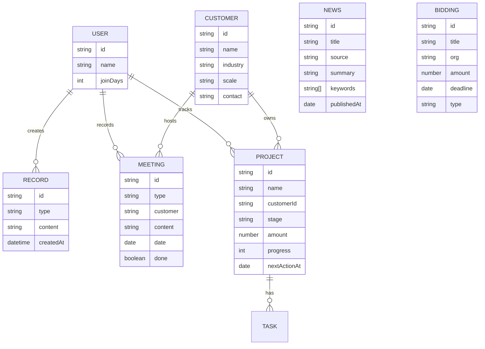

# 技术架构文档：之欧智能语音工作台

## 1. 架构设计

纯前端单页应用，使用 React + Vite + Tailwind CSS + Zustand。所有数据通过 Mock 数据 + LocalStorage 持久化。

## 2. 技术描述

- **前端框架**：React 18
- **构建工具**：Vite 5
- **样式方案**：Tailwind CSS 3
- **路由**：React Router 6
- **图标**：Lucide React
- **状态管理**：Zustand
- **持久化**：浏览器 LocalStorage
- **后端**：无（Mock 数据）
- **数据库**：无

## 3. 路由定义

| 路由 | 用途 |
|------|------|
| `/voice-workbench` | 智能语音工作台（默认页，6 Tab） |
| `/market-radar` | 行业情报（每日新闻 + 招投标） |
| `/meeting-library` | 飞书妙记（会议/方法论/待办/感悟） |
| `/project-tracker` | 项目跟进（多客户多销售组合视图） |
| `/customer-tracker/:id` | 客户项目跟踪（单项目深度视图） |

## 4. 组件结构

```
src/
├── components/
│   ├── Sidebar.tsx               # 侧边导航
│   ├── TopBar.tsx                # 顶部状态栏
│   ├── WorkbenchHeader.tsx       # 工作台标题区
│   ├── TabNav.tsx                # 6 Tab 导航
│   ├── TabContent.tsx            # 6 Tab 内容分发
│   ├── VoiceCard.tsx             # 语音录入卡片
│   ├── TextInputArea.tsx         # 文本输入区
│   ├── FloatingMic.tsx           # 悬浮麦克风
│   ├── CalendarView.tsx          # 日历视图
│   ├── RecordsList.tsx           # 工作记录列表
│   ├── StatsDashboard.tsx        # 数据统计面板
│   ├── ReportGenerator.tsx       # 报告生成
│   ├── NewsList.tsx              # 新闻列表
│   ├── BiddingList.tsx           # 招投标列表
│   ├── MeetingNotes.tsx          # 飞书妙记
│   ├── ProjectGrid.tsx           # 项目网格
│   ├── CustomerTracker.tsx       # 客户项目深度视图
│   └── ui/
│       ├── Badge.tsx             # 角标
│       ├── Card.tsx              # 卡片
│       └── SearchInput.tsx       # 搜索框
├── pages/
│   ├── VoiceWorkbench.tsx        # 工作台首页
│   ├── MarketRadar.tsx           # 行业情报
│   ├── MeetingLibrary.tsx        # 飞书妙记
│   ├── ProjectTracker.tsx        # 项目跟进
│   ├── CustomerTracker.tsx       # 客户项目跟踪
│   └── PlaceholderPage.tsx       # 占位页
├── store/
│   ├── useWorkbenchStore.ts      # 工作台状态
│   ├── useNewsStore.ts           # 行业新闻
│   ├── useMeetingStore.ts        # 飞书妙记
│   ├── useProjectStore.ts        # 项目跟进
│   └── useCustomerStore.ts       # 客户信息
├── data/
│   ├── mock.ts                   # 通用 Mock
│   ├── news.ts                   # 行业新闻 Mock
│   ├── meetings.ts               # 飞书妙记 Mock
│   ├── projects.ts               # 项目 Mock
│   └── customers.ts              # 客户 Mock
├── types/
│   └── index.ts                  # TypeScript 类型
├── App.tsx
└── main.tsx
```

## 5. 数据模型

### 5.1 数据模型定义



### 5.2 数据类型定义

```typescript
type RecordType = 'schedule' | 'memo' | 'order' | 'visit' | 'quote' | 'task' | 'call' | 'meeting';
type Stage = 'lead' | 'contact' | 'quote' | 'won' | 'aftersale';
type MeetingType = 'minutes' | 'methodology' | 'todo' | 'insight';

interface WorkbenchRecord { id, type, content, createdAt, customer?, reminderAt? }
interface NewsItem { id, title, source, summary, keywords[], publishedAt }
interface BiddingItem { id, title, org, amount, deadline, type }
interface MeetingItem { id, type, customer, content, date, done? }
interface ProjectItem { id, name, customerId, stage, amount, progress, nextActionAt, nextAction }
interface CustomerItem { id, name, industry, scale, contact, avatar? }
```
